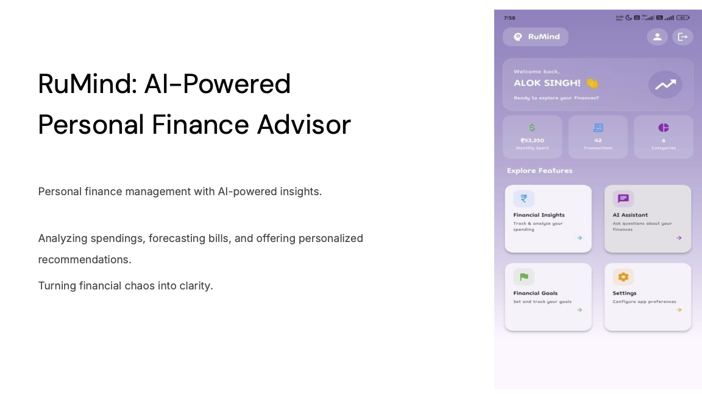
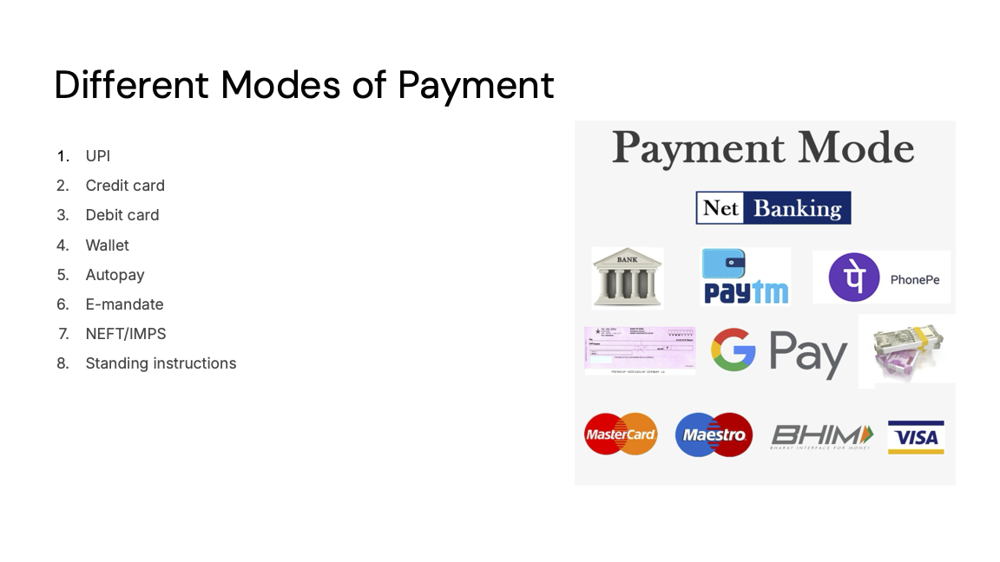
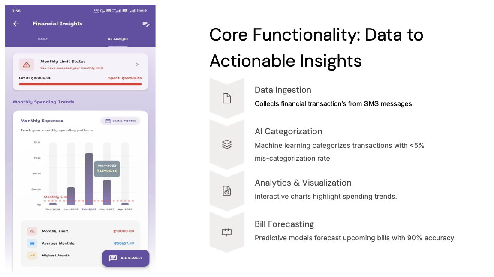
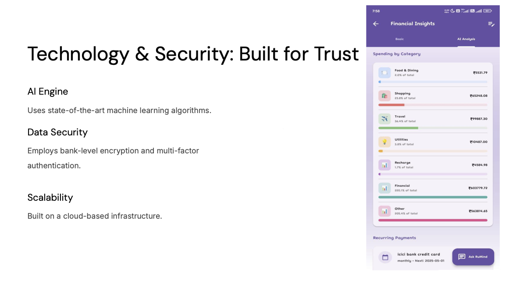
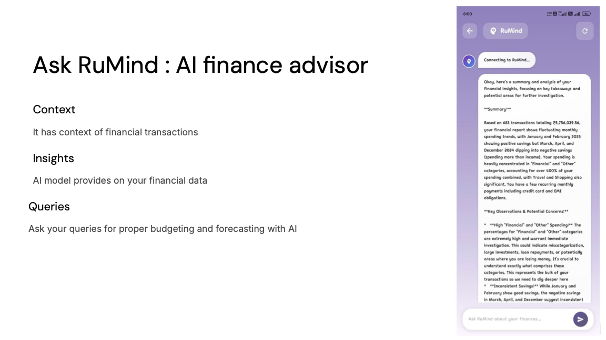

# Brain Train - AI-Powered Personal Finance Manager

Personal finance management with AI-powered insights.

Analyzing spending, forecasting bills, and offering personalized recommendations.
**Turning financial chaos into clarity.**

## Features

### 🔒 Secure SMS Analysis
- Reads SMS messages securely, filtering only financial transactions
- Privacy-first approach to transaction data processing
- Automated detection of bank transactions, payments, and recharges

### 🧠 AI-Powered Insights
- Advanced spending pattern analysis using AI algorithms
- Personalized cost-cutting recommendations
- Smart categorization of expenses and income

### 📊 Financial Intelligence
- **Spending Habits Analysis** - Understand where your money goes
- **Bill Forecasting** - Predict upcoming payments and due dates
- **Budget Optimization** - Get actionable advice to reduce expenses
- **Recharge Management** - Track and manage recurring payments

### 💬 AI Financial Assistant
- Chat with AI about your financial insights
- Get personalized advice based on your spending patterns
- Ask questions about your financial health and goals

## Showcase









## Tech Stack

- **Frontend**: Flutter (iOS & Android)
- **AI/ML**: Google Gemini AI integration
- **Backend**: Firebase integration
- **SMS Processing**: Secure local SMS filtering and analysis

## Getting Started

### Prerequisites
- Flutter SDK
- Firebase project setup
- Gemini AI API key

### Installation

1. Clone the repository
```bash
git clone <repository-url>
cd brain_train
```

2. Install dependencies
```bash
flutter pub get
```

3. Configure Firebase
   - Add your `google-services.json` (Android)
   - Add your `GoogleService-Info.plist` (iOS)

4. Configure AI service
   - Add your Gemini API key in `lib/core/config/api_keys.dart`

5. Run the app
```bash
flutter run
```

## Privacy & Security

This app processes financial SMS data locally on your device. No sensitive transaction details are transmitted to external servers without encryption and user consent. All AI analysis happens through secure, encrypted channels.

---

*Making financial management intelligent, intuitive, and insightful.*
